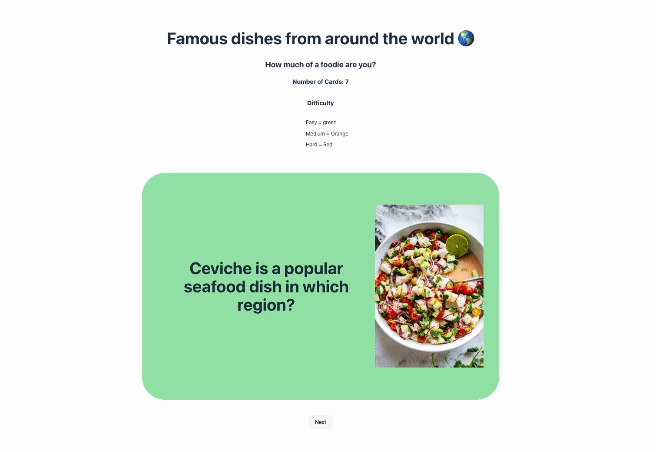

# Flashcards
Flashcards is a flashcard-like format that users can then use to study, learn something new, or play a guessing game. 

Users will be able to: 
- study cards in a randomized order
- submit a guess before seeing the flipside of a card
- can navigate through an ordered list of cards
- click a shuffle button to randomize the order of the cards

**The following **required** functionality is completed:**

- [x] The user can submit a guess before seeing the flipside of a card

- [x] The user can navigate through an ordered list of cards

**The following **optional** functionality are implemented:**

- [x] A shuffle button can be used to randomize the order of the cards

- [ ] A user’s answer may be counted as correct even when it is slightly different from the target answer

- [x] A counter displays the user’s current and longest streak of correct responses

- [ ] A user can mark a card that they have mastered and have it removed from the pool of answers

# Here's how Flashcards looks:



# Getting started
**Install dependencies**
```
npm install
```

**Run the application in developer mode**

```
npm run dev
```

**Open project in the browser**

In the command line Vite will display a link, such as http://127.0.0.1:5173 to click on or copy/paste that will take you to the localhost port where the project is running.

**Tip:** If you'd like to stop the server, you can use ctrl + c or cmd + c within the Terminal, or use the trash can icon in the top right of the Terminal within VS Code. To run the server again, simply use npm run dev again.